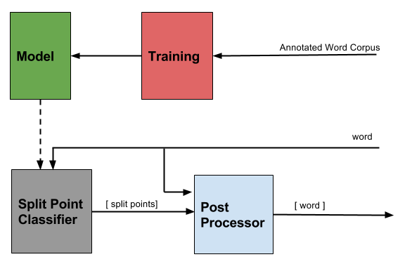

.. sandhi-splitter documentation master file, created by
   sphinx-quickstart on Sat Jul 16 08:56:12 2016.
   You can adapt this file completely to your liking, but it should at least
   contain the root `toctree` directive.

sandhi-splitter
===============

Module Design 
-------------

Installation
------------

The module supports both python2.7 and python3. To install:

.. code-block:: bash

    git clone https://github.com/libindic/sandhi-splitter.git
    cd sandhi-splitter
    python setup.py install

For development purposes, you can use a virtualenv.

.. code-block:: bash

    git clone https://github.com/libindic/sandhi-splitter.git
    cd sandhi-splitter
    virtualenv env
    . env/bin/activate
    python setup.py install

Training and Testing Model
--------------------------

Two console scripts have been provided for training and testing purposes.
Post installation, these can be used to generate and test models.

Help has been provided in the scripts.

Training
++++++++

.. code-block:: bash

    $ sandhisplitter_train -h
	usage: sandhisplitter_train [-h] -k DEPTH -s SKIP -i TRAINFILE -o MODELFILE

	Train a model

	optional arguments:
	  -h, --help            show this help message and exit
	  -k DEPTH, --depth DEPTH
							depth of the trie
	  -s SKIP, --skip SKIP  initial skip
	  -i TRAINFILE, --trainfile TRAINFILE
							path to training file
	  -o MODELFILE, --outputfile MODELFILE
							path to store model

To understand the parameters ``DEPTH`` and ``SKIP``, please refer to the paper this is based on: `Sandhi Splitter for Malayalam <http://ltrc.iiit.ac.in/icon2015/icon2014_proceedings/papers/File71-p164.pdf>`_.

``TRAINFILE`` should contain data in the following format:

.. code-block:: none

    word=word1+word2+word3|loc1,loc2,loc3

The locations should be the indices of the character before the split point in a 0-based indexed string. For example, consider ``takeaway``.

.. code-block:: none

    takeaway=take+away|3

Please have a look at `data/owndata <https://github.com/jerinphilip/sandhi-splitter/blob/master/data/owndata>`_ if you still have doubts.

Testing
+++++++

.. code-block:: bash

    $ sandhisplitter_benchmark_model -h
	usage: sandhisplitter_benchmark_model [-h] -m MODELFILE -t TESTFILE -u OUTPUT

	Test a model

	optional arguments:
	  -h, --help            show this help message and exit
	  -m MODELFILE, --modelfile MODELFILE
							path to model file
	  -t TESTFILE, --testfile TESTFILE
							path to test file

The ``MODELFILE`` here is the output generated by the training script. ``TESTFILE`` should follow the same syntax as the one mentioned in training.

Using the module
----------------

>>> from sandhisplitter import Sandhisplitter
>>> s = Sandhisplitter()
>>> s.split('ആദ്യമെത്തി')
(['ആദ്യം', 'എത്തി'], [4])
>>> s.split('വയ്യാതെയായി')
(['വയ്യാതെ', 'ആയി'], [7])    
>>> s.split('അവന്റെയാണ്')
(['അവന്റെ', '', 'ആണ്'], [5, 6])
>>> s.split('എന്നെക്കൊണ്ടുവയ്യ')
(['എന്നെക്കൊണ്ടുവയ്യ'], [])
>>> s.split('ഇന്നത്തെക്കാലത്ത്')
(['ഇന്നത്തെക്കാലത്ത്'], [])
>>> s.split('എന്തൊക്കെയോ')
(['എന്ത്', 'ഒക്കെയോ'], [3])
